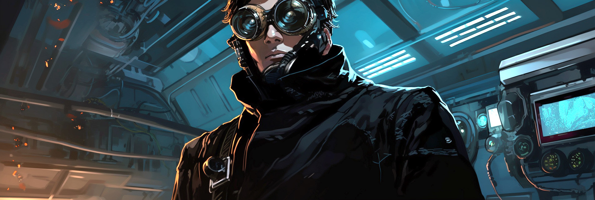

### Hi there 👋 I'm Moon 🌙

Full-stack engineer, entrepreneur and product designer with a passion for building things that make a difference.

### Website / Portfolio
- https://moon.graphics/

### Blog
- https://lalalune.github.io/blog

### Projects

#### Eliza

- https://github.com/lalalune/eliza
- A powerful social agent on Twitter and Discord

#### Bgent

- https://bgent.org
- why bgent? because 'agent' was already taken on npm`
- `npm install bgent`

#### Character Studio

- Free open source character creator, built in javascript
- https://github.com/M3-org/characterstudio

#### Magick

- Node-based AI workflow editor and agent builder
- https://github.com/Oneirocom/Magick

#### TinyAGI

- Lightweight autonomous agent
- https://github.com/AutonomousResearchGroup/tinyagi

#### Autocoder

- Self-coding AI agent
- https://github.com/AutonomousResearchGroup/autocoder

#### agentmemory

- pip install agentmemory
- Dead-simple vector database for agents, documents and knowledge graphing
- https://github.com/AutonomousResearchGroup/agentmemory

#### easycompletion

- pip install easycompletion
- Text and function completions with OpenAI (and local models using LocalAI!)
- https://github.com/AutonomousResearchGroup/easycompletion

### Groups I Support

- **M3** https://m3org.com/
- **Open Metaverse Interoperability Group** https://omigroup.org/
- **Effective Acceleration** https://www.effectiveacceleration.org/
- **The Alliance** https://github.com/JoinTheAlliance/start-here
